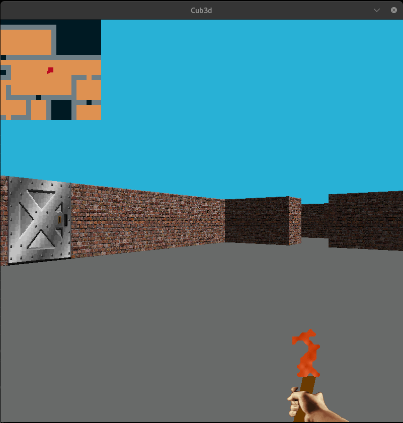

# Cub3d

| Project Name | Cub3d |
| :-: | :-: |
| Description | A raycasting project that aims to reproduct Wolfenstein |
| Technologies | <a href="#"></a> |
| External libraries | open(), close(), read(), write(), printf(), malloc(), free(), perror(), strerror(), exit(), All functions from math.h, All functions of the MinilibX |
| Final grade | 125/125 |

## In game image



## Usage
```
git clone https://github.com/cberganz/Cub3d.git
```
### Simple version
```
make
```
```
./cub3d maps/map.cub
```
### Complete version
```
make bonus
```
```
./cub3d maps/labyrinth.cub
```
